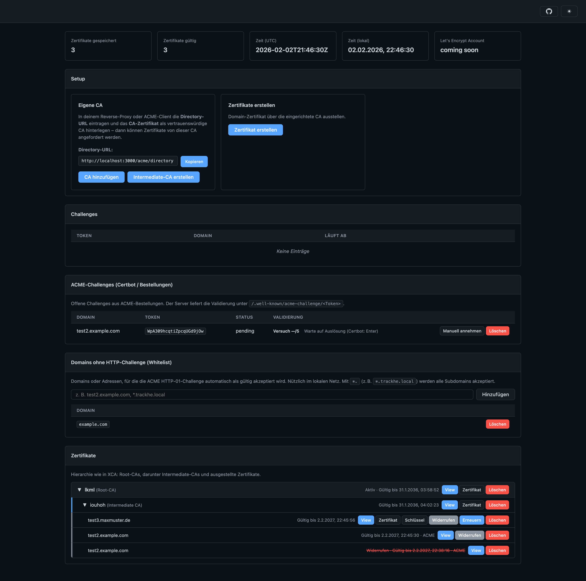

# Cert-Manager

Eigene Certificate Authority (CA) mit Web-Dashboard und ACME-Server. Ermöglicht die Ausstellung von Zertifikaten über ACME-Clients wie Certbot oder Nginx Proxy Manager – ideal für lokale Entwicklung und interne Dienste.



## Voraussetzungen

- [Bun](https://bun.sh) (JavaScript-Runtime)

## Installation

```bash
bun install
```

## Start

```bash
bun run index.ts
```

Die Anwendung startet standardmäßig unter **http://localhost:3000**. Im Browser öffnest du das Dashboard; die ACME-Directory-URL für Clients ist `http://localhost:3000/acme/directory`.

## Testen mit Certbot

Zum Testen eines Zertifikats mit Certbot (manueller Modus, eigene CA als Server):

1. Cert-Manager starten (siehe oben).
2. Im Dashboard eine Root-CA anlegen und aktivieren, falls noch nicht geschehen.
3. Certbot mit folgender Directory-URL und deinen gewünschten Pfaden ausführen:

```bash
certbot certonly \
  --manual \
  --server http://localhost:3000/acme/directory \
  --config-dir ~/Desktop/certtest/config \
  --logs-dir ~/Desktop/certtest/logs \
  --work-dir ~/Desktop/certtest/work \
  --register-unsafely-without-email \
  --key-type rsa -d test2.example.com
```

- Certbot zeigt die HTTP-01-Challenge an. Die Challenge kannst du im Dashboard **manuell annehmen** oder die Domain in die **Whitelist** eintragen (dann wird sie automatisch akzeptiert).
- Danach in Certbot mit Enter bestätigen; das Zertifikat wird ausgestellt und erscheint im Dashboard unter Zertifikate.

**Hinweis:** `--key-type rsa` ist erforderlich, da die CA derzeit nur RSA unterstützt.

## Lizenz & Repo

- [Cert-Manager auf GitHub](https://github.com/Trackhe/Cert-Manager)
