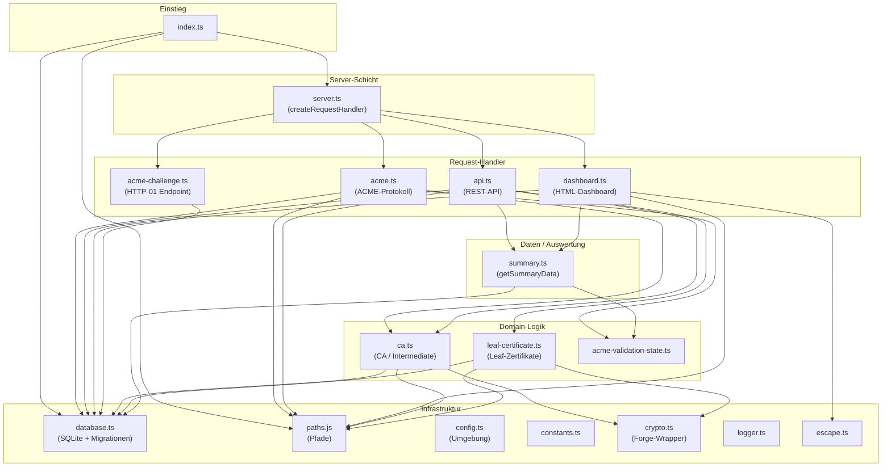

# Komponentendiagramm Cert-Manager

Überblick über die Hauptkomponenten und ihre Abhängigkeiten.

## Legende

| Komponente | Verantwortung |
|------------|---------------|
| **index.ts** | Start, DB-Migrationen, Server starten, Validation-Polling starten |
| **server.ts** | Routing: `/` → Dashboard, `/acme/*` → ACME, `/api/*` → API, `/.well-known/acme-challenge/*` → Challenge |
| **acme.ts** | ACME Directory, new-order, chall, finalize, authz, order, cert, CA-URL; Challenge-Validierung + Cleanup |
| **api.ts** | REST-Endpunkte für CA, Zertifikate, Challenges, Whitelist, Events (SSE) |
| **dashboard.ts** | HTML-Render des Dashboards, initialData, Client-Script (Events, UI) |
| **acme-challenge.ts** | Liefert `key_authorization` unter `/.well-known/acme-challenge/:token` |
| **ca.ts** | Root-CA und Intermediate-CA anlegen, Schlüssel/Zertifikate (Forge) |
| **leaf-certificate.ts** | Leaf-Zertifikat ausstellen (Dashboard/API), Forge + Signer-CA |
| **acme-validation-state.ts** | In-Memory-State für Validierungsversuche und Cooldown |
| **database.ts** | SQLite-Erstellung, Schema, Migrationen (ensureColumn) |
| **summary.ts** | Aggregation für Dashboard/Events (Zertifikate, Challenges, CAS, Whitelist) |
| **paths.ts** | Pfade für CA/Intermediate/Leaf-Dateien (Keys, Certs) |
| **config.ts** | DATA_DIR, DB_PATH, PORT aus Umgebung |
| **crypto.ts** | Hash für Signatur (getDigestForSigning), Subject-Attribute (buildSubjectAttributes) |
| **escape.ts** | htmlEscape, attrEscape, escapeForScript (XSS/JSON) |
