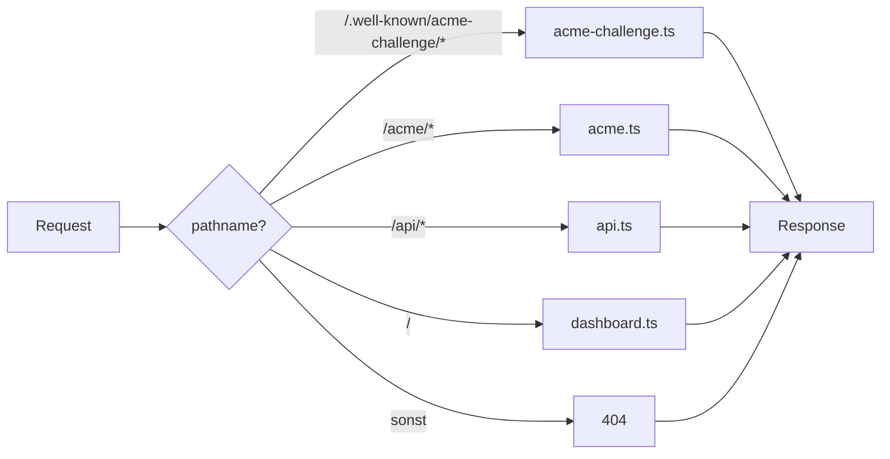
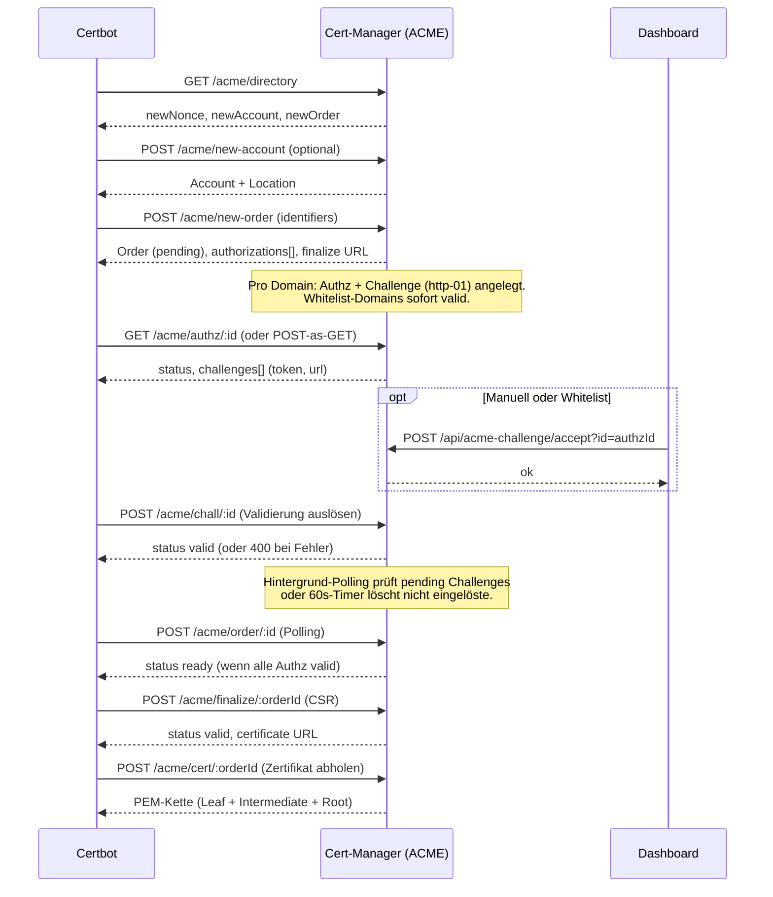
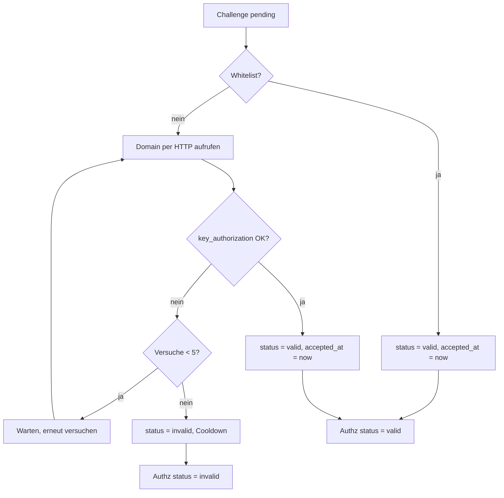
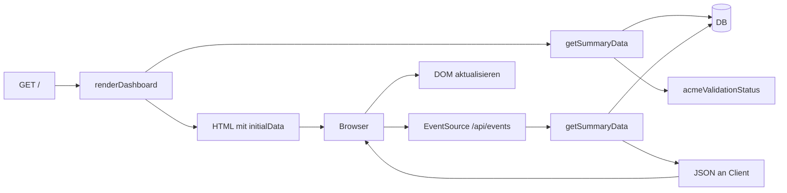
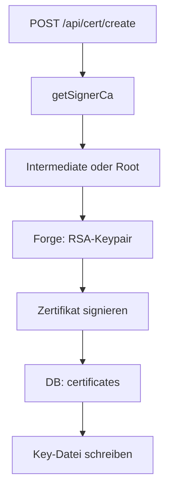
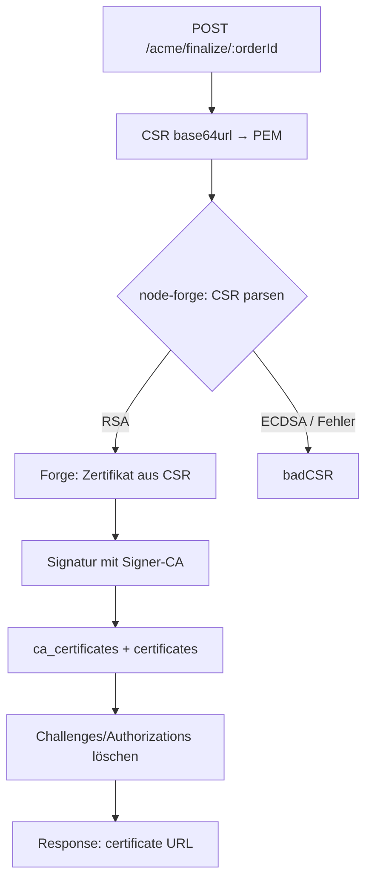

# Ablaufdiagramme Cert-Manager

## 1. HTTP-Request-Routing (Server)



## 2. ACME: Zertifikat anfordern (Certbot-Flow)



## 3. ACME: Challenge-Validierung (HTTP-01)



## 4. Dashboard laden (Server-Render + Events)



## 5. CA erstellen (Setup)

```mermaid
flowchart TB
  A[POST /api/ca/setup] --> B[ca.createRootCa]
  B --> C[Forge: RSA-Keypair]
  C --> D[Zertifikat (self-signed)]
  D --> E[Schreiben: Key + Cert]
  E --> F[DB: cas]
  F --> G[Falls keine aktive CA: active_ca_id setzen]
```

## 6. Leaf-Zertifikat ausstellen (API)



## 7. ACME Finalize (CSR → Zertifikat)


